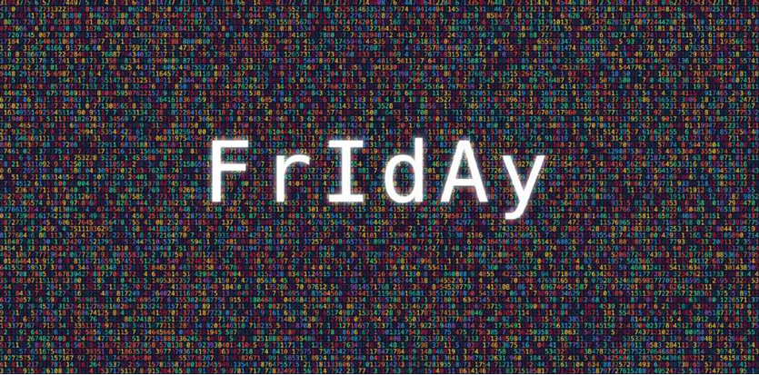
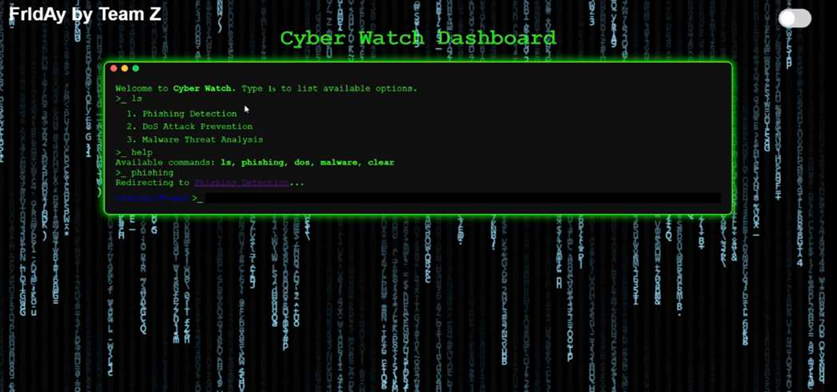
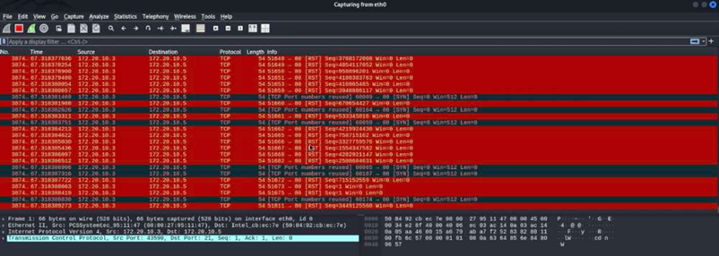
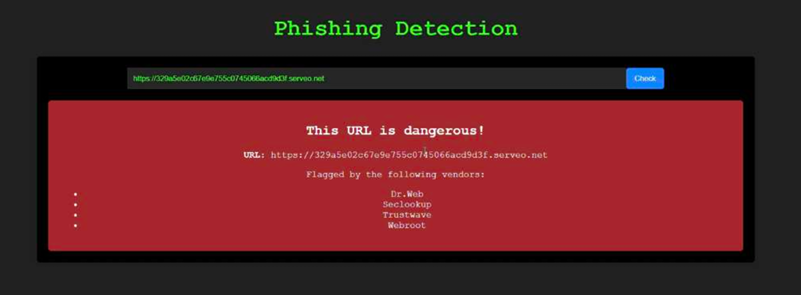
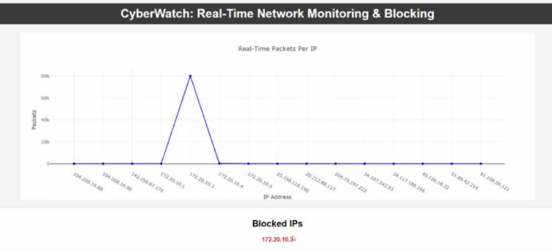
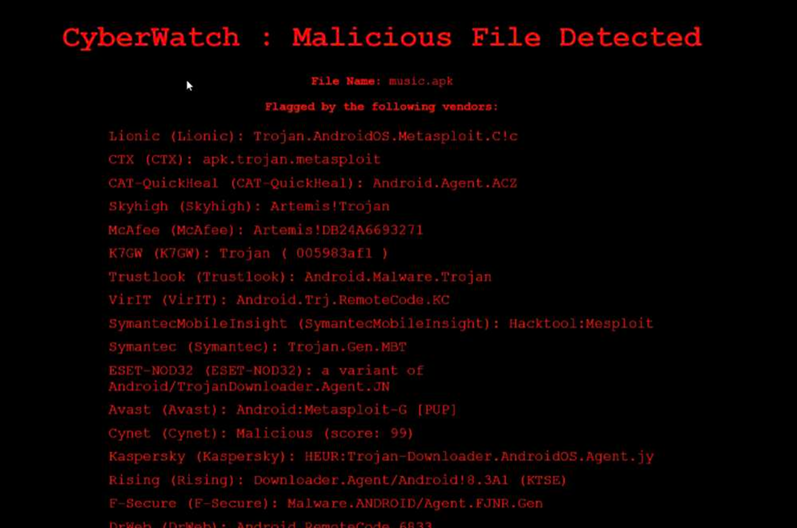

  

# FrIdAy
ML Based Offensive Security

  

--------------------------------------------------------------------------------------------
Our aim was to create a suite of tools to prevent cyber attacks in real time. We have 
successfully implemented the following. 
--------------------------------------------------------------------------------------------

1. We have successfully created our own datasets by performing cyber attacks in real time 
and converting these logs into CSV format using TShark tool.

  

2. We have successfully implemented a Transformer based model using hash mapping to 
prevent Phishing. Our tool detects malicious links and blocks them, if the links are not 
malicious the tool allows access to the website.

  

3. We have successfully implemented an LSTM based model to detect Denial of Service 
attacks. Our model works by detecting a DoS attack and raising a caution for the IP 
address, subsequently blocking the IP address. 

  

4. We have successfully implemented a malware detection system that utilises 
Steganography detection techniques to identify if a particular file or software has virus 
embedded in it or not. If Malware is present it alerts the user and analyse the type of
malware

  

---------------------------------------------------------------------------------------------

Video Demonstration Drive Link: https://drive.google.com/file/d/14xOLXIae2rPKpW_pJTBGFaL0-d7xQvSC/view?usp=sharing
---------------------------------------------------------------------------------------------

Note: We are not uploading our code here because we want to patent this product and implement in our startup.
